# Homelab — GitOps-Managed Kubernetes Cluster

A bare-metal Kubernetes cluster running on **Talos Linux**, fully declarative and reconciled by **ArgoCD**. Every workload, network policy, certificate, and dashboard in this cluster is defined in this repository — there is no `kubectl apply` in the deployment path and no SSH access to the nodes.

This repo is the single source of truth. If it isn't committed here, it isn't running.

---

## Why this exists

I wanted an environment to practice the operational side of infrastructure rather than just the provisioning side: GitOps reconciliation, certificate lifecycle, ingress security, log/metric pipelines, and the day-2 problems that only show up when something has been running for months. Self-hosting real services with real uptime expectations makes those problems concrete.

---

## Platform

| Layer | Choice | Rationale |
|---|---|---|
| **OS** | Talos Linux v1.13.3 | Immutable, API-driven, no shell and no SSH daemon. Config drift is structurally impossible — the node is reconciled from a machine config, not patched in place. |
| **Kubernetes** | v1.36.1 | Cluster `talos-homelab`, single control plane + worker, `etcd` on the control plane. |
| **GitOps** | ArgoCD | 8 `Application` resources; Helm charts and their values are composed from separate sources. |
| **Ingress** | Traefik (bundled, configured via `HelmChartConfig`) | Chart values are patched declaratively rather than forked. |
| **Load balancing** | MetalLB (L2) | Pool `192.168.1.60-89` hands real LAN IPs to `LoadBalancer` services. |
| **TLS** | cert-manager + Let's Encrypt | **DNS-01** via Cloudflare, so internal-only hostnames get valid public certs without exposing anything to the internet. |
| **DNS** | CoreDNS → AdGuard Home | Cluster DNS forwards upstream to AdGuard for network-wide filtering and split-horizon resolution of `*.lan.shiba-toast.com`. |
| **Storage** | `local-path`, `hostPath` PVs, NFS | Chosen per workload — see [Storage](#storage). |

### Why Talos over a conventional distro

The interesting property isn't that it's minimal, it's that **there is nothing to configure imperatively**. There is no package manager, no systemd units to hand-edit, no SSH. The entire machine is described by `controlplane.yaml` / `worker.yaml` and applied over a mutually-authenticated gRPC API. A node that misbehaves is replaced, not repaired. That forces the same discipline at the OS layer that GitOps enforces at the workload layer.

---

## GitOps model

```
argocd/apps/*.yaml          →  ArgoCD Applications (the "app of apps" layer)
  ├── core/                 →  cluster primitives: traefik, cert-manager, metallb, coredns, namespaces
  ├── apps/monitoring/      →  observability + infra monitoring
  ├── apps/utilities/       →  self-hosted user-facing services
  └── apps/arr-stacks/      →  media automation
```

Two patterns are used deliberately:

**Directory applications** (`monitoring`, `utilities`, `arr-stacks`) recurse a path and apply raw manifests. Simple, no templating indirection.

**Multi-source Helm applications** (`prometheus`, `loki`, `promtail`, `homepage`, `ghost`) pull the chart from its upstream repo and the values file from *this* repo via the `$values` ref:

```yaml
sources:
  - repoURL: https://prometheus-community.github.io/helm-charts
    chart: kube-prometheus-stack
    targetRevision: "86.3.2"
    helm:
      valueFiles:
        - $values/core/prometheus/values.yaml
  - repoURL: https://github.com/kevin000001505/Homelab.git
    targetRevision: HEAD
    ref: values
```

This avoids vendoring upstream charts while keeping values under version control and pinned to an explicit chart version — upstream can't ship a surprise on the next sync.

### Sync policy is intentionally not uniform

`utilities` and `ghost` run `automated: { prune: true, selfHeal: true }`. `monitoring` and `arr-stacks` have automation **commented out** and sync manually. That is a deliberate blast-radius decision: self-heal on a stateful media stack with `Retain` PVs can prune something expensive to rebuild, so those get a human in the loop until I trust the manifests.

### Handling out-of-band secrets without fighting the reconciler

Ghost's SMTP credentials are injected directly into a chart-managed `Secret`, which normally means ArgoCD reverts them on every sync. Solved with a scoped `ignoreDifferences` plus `RespectIgnoreDifferences=true` so the exception applies to *sync operations*, not just drift detection:

```yaml
ignoreDifferences:
  - group: ""
    kind: Secret
    name: my-ghost-ghost-on-kubernetes-config
    jsonPointers: [/data]
syncOptions:
  - RespectIgnoreDifferences=true
```

Without the second flag, drift detection stays green while the sync silently overwrites the credentials — a failure mode worth knowing about.

---

## Ingress security

Traffic is filtered in layers, applied globally at the Traefik entrypoint and then per-service at the ingress.

**Entrypoint-level** (every request, both `web` and `websecure`):

```
--entrypoints.websecure.http.middlewares=
    kube-system-geoblock@kubernetescrd,
    kube-system-fail2ban@kubernetescrd
```

- **geoblock** — allowlist of `US` / `TW`, unknown countries denied, local requests permitted.
- **fail2ban** — 4 failures in 10m on status `400,401,403-499` → 3h ban; RFC1918 ranges allowlisted so LAN clients can't lock themselves out.
- **CrowdSec** — bouncer plugin for community-sourced reputation blocking.

**Per-ingress**: internal dashboards (`uptime`, `speedtest`, `bentopdf`) sit behind an **Authentik forwardAuth** middleware, which returns identity headers (`X-authentik-username`, `-groups`, `-email`, JWT) to the upstream service. This gives SSO to applications that have no native auth, without each one implementing its own.

**Split exposure model:** `*.lan.shiba-toast.com` resolves only internally; `*.shiba-toast.com` (Dawarich, Trek) is genuinely internet-reachable and therefore carries geoblock + fail2ban explicitly. Remote access to the internal set is via Tailscale rather than a published port.

---

## Observability

```
pods ──▶ Promtail (DaemonSet) ──▶ Loki ──▶ Grafana
nodes ─▶ kube-prometheus-stack (Prometheus + Alertmanager + Grafana)
Traefik ─▶ /metrics :8082 ──▶ Prometheus
```

- **Loki** runs in `SingleBinary` mode on the filesystem backend with `replication_factor: 1`. A read/write/backend split would be the correct production topology; at one node it is pure overhead, so the scaled components are explicitly set to `replicas: 0`.
- **Promtail** has a dedicated scrape job for Traefik that parses its JSON access log and promotes `status_code` and `method` to labels — which is what makes "show me every 5xx by route in the last hour" a fast query instead of a full-text scan.
- **Traefik** exports Prometheus metrics on a separate `metrics` entrypoint (`:8082`) with entrypoint and service labels enabled.
- **Uptime Kuma** provides black-box checks as a deliberately independent signal — if the monitoring stack itself is down, the in-cluster metrics can't tell me.

---

## Storage

Storage class is chosen per workload rather than by default:

| Pattern | Used for | Trade-off accepted |
|---|---|---|
| `hostPath` PV + `Retain` | Uptime Kuma, Speedtest, Dawarich, Trek | Node-pinned, but survives a reclaim and is trivially backed up from the host path. |
| `local-path` | Ghost + MySQL | Dynamic provisioning where node affinity is acceptable. |
| NFS | Media in `arr-stacks` | Shared across nodes; the media library must outlive any node. |

Workloads on `ReadWriteOnce` volumes use `strategy: Recreate` rather than `RollingUpdate` — a rolling update would deadlock on the second pod failing to attach the volume. Small detail, common outage.

---

## Workload hygiene

- Resource `requests`/`limits` on most workloads (see [Known gaps](#known-gaps)).
- `livenessProbe` + `readinessProbe` on all application deployments.
- `revisionHistoryLimit` trimmed to keep rollback history bounded.
- `node-type` labels (`general` / `gpu`) with `nodeSelector` pinning, so log/metric collectors stay on the general worker and future transcoding workloads land on the GPU node.
- Image tags pinned to explicit versions (`louislam/uptime-kuma:2.4.0`) — no `:latest` in the deployment path.

---

## Services

| Namespace | Services |
|---|---|
| `monitoring` | kube-prometheus-stack, Loki, Promtail, Uptime Kuma, Speedtest Tracker (+MariaDB), Homepage, Tracearr |
| `utilities` | Ghost (blog), Dawarich (location history — app/db/redis/sidekiq/photon), Open WebUI, Glance, BentoPDF, Trek |
| `arr-stacks` | Subsyncarr |
| `argocd` | ArgoCD |

---

## Known gaps

Documented deliberately — these are the next items of work, not oversights I haven't noticed.

- **No `securityContext` on application workloads.** Nothing sets `runAsNonRoot`, `readOnlyRootFilesystem`, or drops capabilities. Pod Security Admission is not enforced at the namespace level either. This is the largest remaining hardening gap.
- **Secrets are managed out-of-band.** `secret.yaml` files are git-ignored and applied manually, which means secret state is *not* reproducible from this repo. Migrating to Sealed Secrets or SOPS + age is the correct fix and is the next planned change.
- **No `NetworkPolicy`.** Pod-to-pod traffic is unrestricted across namespaces; a compromise in one workload has lateral reach.
- **Missing resource limits** on `dawarich/db`, `dawarich/redis`, and `glance` — an unbounded Postgres or Redis can evict neighbours on a single-worker cluster.
- **Traefik API is served with `--api.insecure=true`**, exposing the dashboard on the internal entrypoint without auth. The `IngressRoute` should point at an authenticated router instead.
- **Loki has `auth_enabled: false`** — acceptable single-tenant, but it means any in-cluster pod can read all logs.
- **Single control plane.** No etcd quorum; control-plane loss means a restore, not a failover.
- **No automated backup/restore drill.** PVs use `Retain` and NFS holds the bulk data, but "the volume still exists" is not the same as a tested restore.

---

## Repository layout

```
├── controlplane.yaml / worker.yaml   # Talos machine configs (git-ignored — contain cluster PKI)
├── core/                             # cluster primitives
│   ├── traefik/                      # ingress + geoblock / fail2ban / crowdsec / authentik middleware
│   ├── cert-manager/                 # Let's Encrypt ClusterIssuer (DNS-01 via Cloudflare)
│   ├── metallb/                      # L2 address pool
│   ├── coredns/                      # upstream forward to AdGuard
│   ├── prometheus/                   # kube-prometheus-stack values
│   └── namespaces/
├── apps/                             # workloads, grouped by namespace
├── argocd/apps/                      # ArgoCD Application definitions
└── docs/                             # architecture diagram
```

---

## Bootstrap

The cluster is intentionally reproducible from three steps:

```bash
# 1. Provision nodes (Talos machine configs are generated, not committed)
talosctl apply-config --insecure --nodes <node-ip> --file controlplane.yaml
talosctl bootstrap --nodes <control-plane-ip>

# 2. Install ArgoCD, then point it at this repo
kubectl apply -n argocd -f argocd/apps/

# 3. Everything else reconciles from git
```
